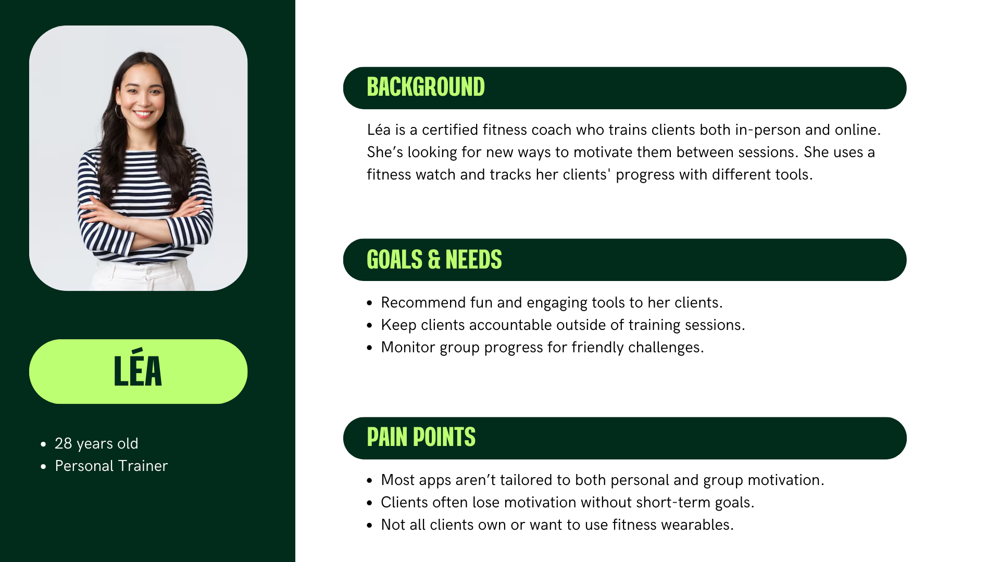

# Functional Specifications

Table of Contents

- [Functional Specifications](#functional-specifications)
  - [1. Introduction](#1-introduction)
    - [1.1. Glossary](#11-glossary)
    - [1.2. Project Overview](#12-project-overview)
    - [1.3. Project Definition](#13-project-definition)
      - [1.3.1. Vision](#131-vision)
      - [1.3.2. Objectives](#132-objectives)
      - [1.3.3. Scopes](#133-scopes)
      - [1.3.4. Target Audience](#134-target-audience)
      - [1.3.5. Deliverables](#135-deliverables)
    - [1.4. Project Organization](#14-project-organization)
      - [1.4.1. Project Representatives](#141-project-representatives)
      - [1.4.2. Stakeholders](#142-stakeholders)
    - [1.5. Project Plan](#15-project-plan)
      - [1.5.1. Milestones](#151-milestones)
      - [1.5.2. Dependencies](#152-dependencies)
      - [1.5.3. Assumptions / Contraints](#153-assumptions--contraints)
      - [1.5.4. Risks / Mitigation](#154-risks--mitigation)
  - [2. Personas and Use Cases](#2-personas-and-use-cases)
    - [2.1. Personas](#21-personas)
      - [2.1.1. Maxime](#211-maxime)
      - [2.1.2. Léa](#212-léa)
      - [2.1.3. Hugo](#213-hugo)
    - [2.2. Use Cases](#22-use-cases)
  - [3. Functional Requirements](#3-functional-requirements)
    - [3.1. Mobile Application Implementation](#31-mobile-application-implementation)
      - [3.1.1. Feature Set](#311-feature-set)
    - [3.2.](#32)
    - [3.X. Workflow](#3x-workflow)
  - [4. Non-functional Requirements](#4-non-functional-requirements)

## 1. Introduction

### 1.1. Glossary

### 1.2. Project Overview

Tomodachi Sport is a mobile application that gamifies physical activity. Inspired by Tamagotchis, users create and evolve a digital avatar that grows based on real-life exercise. 
Through a blend of social interaction, competition, and personalization, the app aims to make fitness fun, consistent, and community-driven.

### 1.3. Project Definition

#### 1.3.1. Vision

Transform exercising into a fun, engaging, and social experience. 
Encourage a healthy lifestyle by rewarding real-life activity with in-app progress and competitive features.

#### 1.3.2. Objectives

**Main features for Bac+4 presentation that includes:**
- **Develop a working MVP** (Minimum Viable Product).
- **Avatar creation and customization**: Users should be able to create their own virtual character, choosing from a variety of visual options like gender, body shape, facial features, clothing, and accessories. This avatar visually evolves and becomes stronger based on the user's real-world activity data.
- **Friend system** (QR code & friend code): Users can connect with each other by scanning QR codes or entering unique friend codes. Friends are then visible in the app, and their avatars and progress can be viewed, allowing for social comparison and competition.
- **Progress tracking via manual entry and Bluetooth devices**: Users should be able to log physical activity manually or connect to a compatible Bluetooth fitness device (e.g., smartwatch, armband). The app will use this data to update the avatar’s progress and history.
- **Achievement system**: A gamified reward system will motivate users with unlockable achievements such as badges, milestones,cosmetics, and level-ups when completing activities, maintaining streaks, or surpassing personal bests.

**Main features for Bac+5 presentation that includes:**
- **Weekly co-op quests**: Users can team up with friends to complete weekly challenges, such as defeating a boss by collectively reaching a set amount of activity points. These co-op events encourage teamwork and recurring use of the app.
- **Anti-cheat system with anomaly detection**: A more robust anti-cheat module will detect abnormal patterns in activity data, such as unrealistically high speeds, missing biometric feedback, or inconsistencies between movement and heart rate. This ensures fair competition and strengthens trust in the rankings.
- **Global leaderboard**: A competitive ranking system that compares all users. This leaderboard will drive motivation and provide users with a sense of belonging to a global community..

#### 1.3.3. Scopes

This application will be developed using **Flutter**, a cross-platform mobile framework, to ensure compatibility with both Android and iOS devices. The backend will rely on **Firebase**, providing real-time database, authentication, and cloud functions support.

The project will use **Health Connect** on Android instead of Google Fit APIs, following their announced deprecation in 2026. For iOS, Apple **HealthKit** will be the primary integration method.

The scope of the app includes:

- Bluetooth connectivity with smartwatches, fitness bands, and armbands using libraries such as "flutter_blue_plus".

- Activity tracking through:
  1. Manual session launch with selected sport and expected duration (e.g., 2 hours volleyball).
  2. Real-time monitoring of physical activity via Bluetooth devices.
  3. Post-activity submission and validation of performance data (distance, speed, heart rate).

- Implementation of anti-cheat mechanisms that analyze biometric data (e.g., heart rate, speed) and geolocation to detect improbable activity (e.g., declaring a swimming session while driving on a highway).

- Support for all **sports officially recognized by the French government** as well as indoor/gym-based sports (e.g., Basic Fit).

- Gamification logic with avatar progression, rewards, and friend leaderboards.

- Delivery of a feature-complete MVP ready for Bac+4 evaluation, with scalable architecture for future expansion.

#### 1.3.4. Target Audience

- **Fitness enthusiasts**: people looking for a new way to make exercise more attractive and enjoyable.
- **Occasional exercisers**: Those looking to motivate themselves to stay active through rewards and social connections.
- **Gamers**: People drawn to game-like elements, such as character progression and cooperative play, to inspire physical activity.
- **Youth and young adults**: Users familiar with social applications and motivated by peer competition and collaboration.

#### 1.3.5. Deliverables

| Deliverable | Purpose |
| ----------- | ------- |
| Functional Specifications | Detailed documentation of the features used and their non-technical aspects.                                                                    |
| Technical Specifications  | Detailed documentation on the technical implementation of software.                                                                             |
| UI/UX design Figma        | Interactive mockups and visual design prototypes that define the user experience, flows, and overall look of the application.                   |
| MVP BAC+4                 | Minimum viable product that includes core features such as avatar creation, friend system, activity tracking, and achievement integration.      |
| v1.1 BAC+5                | Enhanced version with multiplayer quests, anti-cheat mechanisms, global leaderboard, and third-party device compatibility.                      |
| Test Plan & Test Cases    | A set of scenarios validating the algorithm's performance and accuracy with a strategy to run test suite tests most accurately and efficiently. |
| User Manual               | The end-user documentation for the software explaining how to use each feature, install the app, and troubleshoot common issues.                |
| Installation Guide        | Instructions for downloading and installing the app via the App Store (iOS) and Google Play Store (Android), including required permissions.    |

### 1.4. Project Organization

#### 1.4.1. Project Representatives

| Full Name | Role | Role Description | 
| --------- | ---- | ---------------- | 
| Lucas Megnan | Project manager   | Responsible for the overall planning, execution, and success of the project.                                                                                         | 
| Lucas Megnan | Program manager   | Ensures the project meets expectations.   Is in charge of design.   Responsible for writing the Functional Specifications.                                     | 
| Lucas Megnan | Tech lead         | Makes technical decisions for the project.   Translates the Functional Specification into Technical Specifications.   Does code review.                        | 
| Lucas Megnan | Software engineer | Writes the code.   Writes documentation.   Participate in the technical design.                                                                                | 
| Lucas Megnan | Software engineer | Writes the code.   Writes documentation.   Participate in the technical design.                                                                                | 
| Lucas Megnan | Quality assurance | Tests all the functionalities of a product to find bugs and issues.   Document bugs and issues.   Write the test plan.   Check that issues have been fixed. |    
| Lucas Megnan | Technical writer  | Responsible for creating and maintaining the project's documentation.                                                                                                |

#### 1.4.2. Stakeholders

| Role | Representative | Expectations |
| ---- | -------------- | ------------ |
| Client          | Franck JEANNIN | Finished project meeting requirements.                                  |
| School director | Franck JEANNIN | Clear documentation and management based on the skills learnt in class. |

### 1.5. Project Plan

#### 1.5.1. Milestones

| Milestone |
| --------- |
| **Sprint 1:** - Draft of functional specifications.  - UI/UX Design kickoff with login, main, and avatar creation pages.  - Initial exploration of Bluetooth connectivity and health data APIs.              |
| **Sprint 2:** - Finalization of functional specifications  - Technical specifications draft.  - Start of development for user authentication and avatar creation.  - Setup of Firebase backend.           |
| **Sprint 3:** - Development of friend system and manual activity logging.  - Continued UI improvements and Bluetooth testing.  - Start of reward/achievement system implementation.                          |
| **Sprint 4:** - Full integration with Bluetooth fitness devices.  - Implementation of avatar progression logic and user dashboard.  - Testing of reward and leaderboard systems- First draft of user manual. |
| **Sprint 5:** - Testing and bug fixing of all core systems.  - Final adjustments to UI/UX- Completion of documentation (user manual, test plan).  - Final presentation preparation and app deployment.       |

#### 1.5.2. Dependencies

**Flutter SDK**: Cross-platform mobile development framework used to build the application.
**Firebase**: Backend-as-a-service providing authentication, real-time database, and hosting.
**flutter_blue_plus**: Bluetooth plugin used to connect and communicate with fitness devices.
**Health Connect (Android) and HealthKit (iOS)**: APIs used for retrieving health and activity data.
**Third-party Bluetooth fitness devices**: Must support standard GATT profiles or custom services compatible with flutter_blue_plus.

#### 1.5.3. Assumptions / Contraints

**Assumptions**:

- Users will have access to a smartphone with an internet connection for syncing activity data and using core features.
- Some users may own Bluetooth-compatible fitness devices (e.g., smartwatches, fitness bands, armbands), but their use is optional.
- Users will be able to log physical activity either manually or via connected devices.
- Gamification (avatar progression, achievements, leaderboard) will be an effective motivator for regular app usage.
- Firebase, Flutter, and Bluetooth libraries (e.g., "flutter_blue_plus") will remain stable and supported throughout the development cycle.

**Contraints**:

- The project must be completed by a solo developer within the academic year timeframe (Bac+4 deadline).
- Development is limited to mobile platforms using Flutter for both Android and iOS.
- The application must comply with privacy and data protection standards (e.g., GDPR), especially when dealing with health-related data.
- Bluetooth integration will only be tested on a small range of devices due to hardware access limitations.
- The MVP must function fully without requiring a Bluetooth device, relying instead on manual data input if necessary.
- Health Connect (Android) and HealthKit (iOS) are the only health data APIs to be supported in the MVP.

#### 1.5.4. Risks / Mitigation

| Risk | Mitigation Strategy |
| ---- | ------------------- |
| **Device compatibility issues with Bluetooth**                       | Limit initial support to the most common BLE devices and conduct thorough testing on selected models. |
| **Data inaccuracy or cheating by users**                             | Implement base anti-cheat logic analyzing biometric plausibility and activity consistency.            |
| **Flutter plugin limitations or bugs (flutter\_blue\_plus)**         | Monitor plugin GitHub issues and contribute if needed; prepare backup plan using platform channels.   |
| **Lack of user engagement or motivation**                            | Emphasize gamification, social interaction, and rewarding systems to drive recurring usage.           |
| **Time constraints impacting feature completeness for Bac+4**        | Focus on delivering a polished MVP with scalable architecture for Bac+5 enhancements.                 |
| **Health data access restrictions or API changes (e.g., HealthKit)** | Monitor API deprecation notices and maintain fallback options for manual input.                       |

## 2. Personas and Use Cases

### 2.1. Personas

#### 2.1.1. Maxime

#### 2.1.2. Léa

#### 2.1.3. Hugo

### 2.2. Use Cases

| Use Case | Description |
| -------- | ----------- |
| Create an Avatar             | The user creates and customizes their virtual avatar with gender, body shape, outfit, etc., which evolves based on their activity.            |
| Register and Log In          | The user registers or logs into the application using email/password or a social login method (e.g., Google, Apple).                          |
| Connect a Bluetooth Device   | The user optionally pairs their smartwatch, fitness band, or armband via Bluetooth using `flutter_blue_plus` to sync real-time activity data. |
| Manually Log an Activity     | The user starts a sport session manually by selecting the sport, time, and duration, without needing any external device.                     |
| Track Activity Progress      | The user can view progress in real-time or post-session through biometric and performance data (manually entered or synced).                  |
| Add a Friend                 | The user can add friends by scanning a QR code or entering a friend code. Friends are shown with their avatars and activity levels.           |
| View Friend Profiles         | The user can visit friend pages to see their avatars, completed activities, and progress level.                                               |
| Earn Rewards and Badges      | By completing challenges or maintaining streaks, users unlock visual rewards (badges, achievements, evolutions).                              |
| Participate in Weekly Quests | Users collaborate with friends on time-limited goals, like a boss battle requiring a collective effort of activity points.                    |
| View the Leaderboard         | The user checks national or global rankings by sport, country, or friend group. Rankings are updated based on validated performance data.     |
| Submit Activity for Review   | The app performs data validation (e.g., checking for cheating using heart rate and speed data).                                               |
| Customize Notifications      | The user manages reminders and motivational prompts to stay active or join weekly events.                                                     |

## 3. Functional Requirements

### 3.1. Mobile Application Implementation

**Overview**

Tomodachi Sport is a cross-platform Flutter mobile application that combines real physical activity with the development of a customizable avatar. 
Users must manually start and finish each workout in the app, after selecting the type of sport and estimated duration. 
The application remains inactive during the activity. 
Once the session is completed, the application presents an animated kinematics display showing the avatar's progress. 
The user can then optionally connect a fitness device to synchronize actual performance data. 
A reliability score system evaluates the reliability of the session, directly influencing the level of experience and rewards awarded.

#### 3.1.1. Feature Set

| Feature | Description |
| ------- | ----------- |
| User Registration/Login   | Secure sign-in using email/password or third-party providers (Google, Apple).                                                             |
| Avatar Creation           | Users customize a virtual avatar that evolves based on activity points earned during sessions.                                            |
| Manual Session Launch     | The user must manually start a workout session by selecting a sport and estimated duration.                                               |
| Session Idle Mode         | The app enters an idle (non-tracking) state during the session.                                                                           |
| Session Completion        | The user manually ends the session. This triggers the calculation and visualization of earned points and progress.                        |
| Cinematic Reward Display  | After completing a session, a short animated sequence shows avatar evolution, XP gained, and unlocked rewards.                            |
| Optional Bluetooth Sync   | Users can optionally connect a fitness device after a session to retrieve real activity data (e.g. calories, heart rate, duration).       |
| Reliability Score System  | A score from 0 to 100 evaluates the trustworthiness of the session data. It influences how much XP and rewards the user receives.         |
| Progression & XP System   | Experience and level-ups are earned based on activity type, session duration, and reliability score.                                      |
| Friend System             | Users can add friends via QR code or friend code and compare their avatars and progress.                                                  |
| Weekly Cooperative Quests | Users team up to defeat bosses by accumulating points together during a given time frame.                                                 |
| Leaderboard System        | Leaderboards show top users nationally and globally, sorted by sport type or overall performance.                                         |
| Anti-Cheat Mechanism      | A system detects inconsistent or impossible activity data (e.g. exaggerated distances, no heart rate, or suspicious timing) to adjust XP. |

### 3.2. 

### 3.X. Workflow

## 4. Non-functional Requirements